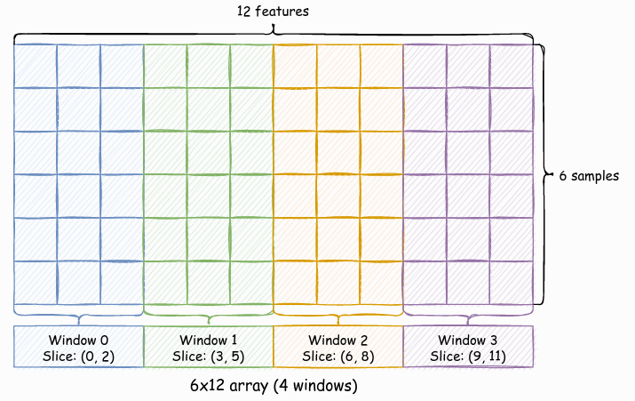

# multimodal-array

`multimodal-array` is a lightweight library to handle multimodal arrays and dataframes.

Several datasets are composed by multi-modal samples. A multi modal sample is a sample where features come from different natures (e.g., different capture devices, configurations, axes, etc.). For instance, in HAR datasets, a sample may be composed by features coming from 6 different natures (6-column vector): accelerometer axis x, accelerometer axis y, accelerometer axis z, gyroscope axis x, gyroscope axis y, gyroscope axis z. Or a sample may be composed by instants of time of data coming from different natures, such as: 300 instants of time of accelerometer axis x, 300 instants of time of accelerometer axis y, 300 instants of time of accelerometer axis z, 300 instants of time of gyroscope axis x, 300 instants of time of gyroscope axis y, 300 instants of time of gyroscope axis z.

MultiModalArray package allow segmenting samples of 1-D and 2-D arrays into windows, that is, collections of columns of the same nature.
An example is shown in Figure below. An numpy array of shape (6, 12), may have 4 windows each window with 3 columns.



MultiModalArray provide some features such as:

- Access each window by index or by name.
- Apply the same function separately to each window of the array and generate a new array.
- Automatic recalculation of windows offsets when a transform is applied.
- Multimodal numpy arrays and Pandas DataFrames.

## Installation

The installation can be done using `pip install`, for instance:

> pip install git+https://github.com/otavioon/multimodal-array.git

## Example

### Multimodal array
```{python}
import numpy as np
from multimodal import MultiModalArray, apply_multimodal_array_func

# Create a numpy array of shape (4, 4)
x = np.arange(16).reshape(4, 4)

# Set 2 windows from array.
# Columns (0, 2) corresponds to window 0 and  (2, 4) to window 1
windows = [(0, 2), (2, 4)]

# Create a multimodal array. Window 0 will have name "a" and 1 name "b"
mm_array = MultiModalArray(x, windows=windows, names=["a", "b"])

# This will return the subarray corresponds to window 0
print(mm_array.window_loc[0])

# Windows can also be accessed using the respective name
print(mm_array.window_loc["a"])

# Print the number of windows
print(mm_array.num_windows)

# Print the windows names
print(mm_array.window_names)

# Data can also be sliced. This will select 0 and 1 rows and then select window 0
print(mm_array[0:2].window_loc[0])

# All above functions will return a MultiModalArray.
# We can return the numpy array using the data method
print(mm_array.data)

# Finally a function can be applied to each window, and the slices are automatically recalculated.
# The function will receive a window of the data (a subarray)
def simple_transform(X: np.ndarray):
    return X+1

# The function simple_transform is applied to each window of mm_array
# and all arrays will be reassembled to new MultiModalArray
res = apply_multimodal_array_func(simple_transform, mm_array)
print(res)

```

### Multimodal dataframe

```{python}
import numpy as np
import pandas as pd
from multimodal import MultiModalDataframe

df = pd.DataFrame(np.arange(16).reshape((4, 4)), columns=["col-0", "col-1", "col-2", "col-3"])
mm_df = MultiModalDataframe(df, windows=[["col-0", "col-1"], ["col-2", "col-3"]], names=["a", "b"])
print(mm_df.window_loc[0]["col-1"])

```

## Running Tests

Tests can be executed usint `pytest`.

> python -m pytest -v
